# ⚠️ Demo Version Notice

> This repository contains the **demo/public version of Zobique**.  
> The complete production-grade version, core AI systems, and advanced architecture are maintained in a **private repository**.

<h1 align="center">
  
</h1>

## 🚀 About Zobique

**India's First AI-Driven Career Development and Job Search Platform**

Zobique is revolutionizing how students and recent graduates build successful careers. We're not just another job portal — we're a comprehensive, intelligent career companion that transforms the entire journey from education to employment.

In a rapidly evolving job market, traditional career guidance falls short. Zobique bridges this gap with cutting-edge AI technology, providing personalized, end-to-end solutions that adapt to each individual's unique profile, aspirations, and market demands. From intelligent resume building to real-time interview preparation, we're empowering India's next generation of professionals with the tools they need to thrive.

**Our mission is simple yet powerful:** Make career success accessible, personalized, and achievable for every student and fresh graduate in India.

---

## 🎯 What Makes Us Different

**Beyond Traditional Job Portals**

While conventional platforms simply list opportunities, Zobique creates them. Our AI-powered approach doesn't just match candidates with jobs — it intelligently prepares them for success.

### Key Differentiators:
- **Personalized Intelligence**: Every recommendation, roadmap, and insight is tailored to your unique profile and career goals
- **End-to-End Support**: From skill development to interview success, we guide you through every step of your career journey
- **Real-Time Preparation**: Dynamic interview prep and role-specific guidance that evolves with market trends
- **Compatibility Scoring**: Advanced AI algorithms that assess your fit for roles before you apply
- **Smart Auto-Apply Technology**: Intelligent bulk applications with customized resumes for each opportunity

---

## 🧠 Core Modules

### **Job Assistance**
*Your AI-Powered Job Search Companion*

- **🎨 AI Resume Builder & Upload**: Create professional resumes instantly or enhance existing ones with AI-driven formatting and optimization
- **🔍 Smart Job Matching**: Advanced compatibility scoring that connects you with roles that truly fit your profile
- **🤖 Job Copilot**: Get role-specific insights, company information, and requirement clarifications in real-time
- **⚡ Dynamic Resume Optimization**: Automatically tailor your resume for each application with our bulk apply feature
- **🎭 AI Interview Preparation**: Practice with mock interviews, receive personalized feedback, and master common questions

### **Career Guidance**
*Intelligent Roadmaps for Your Professional Growth*

- **📊 Behavioral Profiling**: Comprehensive questionnaires and resume analysis to understand your career preferences and strengths
- **🎯 Skill Gap Analysis**: AI-powered identification of missing or weak skills relative to your target roles
- **📚 Personalized Course Recommendations**: Curated upskilling pathways through partnered content and courses
- **🗺️ Career Copilot**: Custom career roadmaps, domain selection advice, and milestone tracking to keep you on the path to success

---

## ✨ Key Features Snapshot

- 🎯 **AI Resume Builder & Intelligent Scanning**
- 🤖 **Job Copilot for Real-time Career Q&A**
- 🎭 **AI Interview Practice with Performance Feedback**
- 📊 **Advanced Skill Gap Analysis**
- 🗺️ **Custom Career Roadmaps & Milestone Tracking**
- 📚 **Smart Course Recommendations with Progress Monitoring**
- ⚡ **Dynamic Resume Optimization & Auto-Apply Technology**
- 🔍 **Intelligent Job Matching with Compatibility Scores**

---

## 🌍 Vision & Impact

**Building India's Job-Ready Future**

At Zobique, we envision a future where every student and graduate has equal access to career opportunities, regardless of their background or location. We're democratizing career development by making world-class, AI-powered guidance accessible to all.

Our platform is designed to address the critical gap between education and employment. By providing intelligent, personalized career support, we're not just helping individuals find jobs — we're building a more skilled, confident, and career-ready workforce that can compete on the global stage.

**We believe that with the right guidance and tools, every young professional can unlock their full potential.** Zobique is that key, opening doors to opportunities that were previously out of reach and empowering millions to build careers they're passionate about.

Through data-driven insights, behavioral analysis, and cutting-edge AI technology, we're redefining what career success looks like in the 21st century. This isn't just about finding a job — it's about building a future.

---

## 🤝 Join Us

**Let's Build the Future of Work Together**

Zobique is more than a platform — it's a movement toward smarter, more inclusive career development. Whether you's a student ready to launch your career, an educator looking to better prepare your students, or a partner interested in transforming India's job ecosystem, we'd love to connect.

**Ready to transform your career journey?** 
Join us in building successful careers with Zobique.

**Interested in partnerships or collaboration?**
Let's work together to democratize career success across India.

*Empowering India's next generation, one career at a time.*

---

# 📐 Frontend Architecture & Project Structure

## Technology Stack

### Core Framework
- **Next.js 15** - React framework with App Router, Server Components, and Turbo mode for fast builds
- **React 19** - UI library with latest features
- **TypeScript** - Type-safe development

### Styling & UI
- **Tailwind CSS 3** - Utility-first CSS framework
- **Radix UI** - Headless component primitives for accessible UI
- **Framer Motion** - Animation library for smooth interactions
- **Recharts** - Data visualization library

### State Management & Data Fetching
- **TanStack React Query** - Server state management and caching
- **Zustand** - Client state management
- **React Hook Form** - Form state management
- **Axios** - HTTP client with custom interceptors

### Authentication & Security
- **Clerk** - User authentication and organization management
- **Sentry** - Error tracking and performance monitoring
- **Google reCAPTCHA** - Bot protection

### Payment & Billing
- **Cashfree Payments SDK v3** - Payment gateway integration
- **Custom Billing Module** - Subscription and usage tracking

### Development & Tooling
- **ESLint** - Code linting and quality
- **PNPM** - Fast, disk space efficient package manager
- **Turbo Mode** - Next.js turbo builds for development speed
- **TurboRepo Ready** - Monorepo support

---

## 📁 Project Directory Structure

```
frontend/
├── app/                          # Next.js App Router (Route Handlers & Layouts)
│   ├── layout.tsx                # Root layout with global providers
│   ├── globals.css               # Global styles
│   ├── (main)/                   # Public routes layout group
│   │   ├── layout.tsx            # Main layout with navigation
│   │   ├── page.tsx              # Homepage
│   │   ├── pricing/              # Pricing page
│   │   ├── features/             # Features showcase
│   │   ├── interview/            # Interview prep section
│   │   ├── resume-ai/            # AI resume builder
│   │   ├── ats/                  # ATS analysis tool
│   │   ├── about-us/             # About page
│   │   └── contact/              # Contact page
│   │
│   ├── (dashboard)/              # Protected routes layout group
│   │   └── dashboard/
│   │       ├── career/           # Career guidance section
│   │       └── [userId]/         # Dynamic user dashboard
│   │
│   ├── (middle)/                 # Middle tier routes
│   │   └── Protected sections
│   │
│   ├── admin/                    # Admin panel routes
│   │   └── Protected admin pages
│   │
│   ├── auth/                     # Authentication pages
│   │   └── (auth)/               # Clerk auth callbacks
│   │
│   ├── org/                      # Organization management
│   │
│   ├── payment/                  # Payment related pages
│   │
│   ├── api/                      # API Route Handlers
│   │   ├── clerk/                # Clerk webhooks
│   │   └── organizations/        # Org-related API endpoints
│   │
│   └── [Other Pages]
│       ├── not-found.tsx         # 404 page
│       ├── global-error.tsx      # Global error boundary
│       ├── loading.tsx           # Global loading state
│       ├── robots.ts             # SEO robots config
│       └── sitemap.ts            # Dynamic sitemap
│
├── components/                   # Reusable React Components
│   ├── AppProviders.tsx          # Context and provider setup
│   ├── AuthForm.tsx              # Authentication form
│   ├── ResumeUploads.tsx         # Resume upload component
│   │
│   ├── AdminComponents/          # Admin-specific UI
│   │   └── [...admin features]
│   │
│   ├── analytics/                # Analytics components
│   │   └── [...charts, tracking]
│   │
│   ├── auth/                     # Auth-related components
│   │   └── [...login, signup]
│   │
│   ├── billing/                  # Billing & subscription UI
│   │   ├── PaymentServicePreloader.tsx
│   │   └── [...pricing, plans]
│   │
│   ├── Dashboard/                # Dashboard components
│   │   └── [...dashboard sections]
│   │
│   ├── Home/                     # Homepage components
│   │   ├── SafeNavigation.tsx    # Navigation bar
│   │   ├── AuthHeader.tsx        # Auth header
│   │   ├── Footer.tsx            # Footer component
│   │   ├── Promise.tsx           # Feature highlight
│   │   └── [...other homepage]
│   │
│   ├── Layout/                   # Layout components
│   │   └── [...common layouts]
│   │
│   ├── loading/                  # Loading states
│   │   └── [...skeleton loaders]
│   │
│   ├── organization/             # Org management UI
│   │   └── [...org features]
│   │
│   ├── Pages/                    # Full page components
│   │   └── [...major pages]
│   │
│   ├── profile/                  # User profile components
│   │   └── [...profile sections]
│   │
│   ├── psychometric/             # Psychometric assessment UI
│   │   └── [...assessment components]
│   │
│   ├── SEO/                      # SEO components
│   │   └── JsonLd.tsx            # Structured data
│   │
│   ├── Shared/                   # Shared utility components
│   │   ├── LaunchOffer.tsx       # Launch offer banner
│   │   ├── ChatBot.tsx           # AI chatbot
│   │   ├── ScrollToTop.tsx       # Scroll to top button
│   │   ├── SentryProvider.tsx    # Error tracking
│   │   └── [...shared utilities]
│   │
│   ├── Testimonials/             # Testimonial components
│   │   └── [...testimonial UI]
│   │
│   └── ui/                       # Base UI components (Radix + Tailwind)
│       ├── button.tsx
│       ├── card.tsx
│       ├── dialog.tsx
│       ├── input.tsx
│       ├── accordion.tsx
│       ├── tabs.tsx
│       ├── dropdown-menu.tsx
│       └── [...50+ UI primitives]
│
├── lib/                          # Utility functions and hooks
│   ├── queryClient.ts            # React Query configuration
│   ├── utils.ts                  # General utilities
│   ├── permissions.ts            # Role-based permissions
│   ├── psychometric-engine.ts    # Assessment logic
│   │
│   ├── api/                      # API service layer
│   │   ├── axiosInstance.ts      # Axios configuration + interceptors
│   │   ├── index.ts              # API export hub
│   │   ├── billing.ts            # Billing API calls
│   │   ├── jobApi.ts             # Job-related API
│   │   ├── resume.ts             # Resume API
│   │   ├── career-botApi.ts      # Career bot API
│   │   ├── career-data.ts        # Career data fetching
│   │   ├── mentor.ts             # Mentor matching API
│   │   ├── feedbackApi.ts        # Feedback submission
│   │   ├── notificationApi.ts    # Notification service
│   │   ├── psychometric.ts       # Assessment APIs
│   │   ├── roadmap_generator.ts  # Career roadmap generation
│   │   ├── advanced_job_chat.ts  # Advanced job chatbot
│   │   ├── contactApi.ts         # Contact form API
│   │   ├── EnterpriseContact.ts  # Enterprise inquiry API
│   │   ├── resume-agent.ts       # Resume agent API
│   │   ├── userStatusApi.ts      # User status tracking
│   │   ├── preferenceApi.ts      # User preferences
│   │   ├── adminApi/             # Admin-specific APIs
│   │   ├── queries/              # React Query hooks
│   │   └── [...more APIs]
│   │
│   ├── auth/                     # Authentication utilities
│   │   ├── auth.ts               # Auth helpers
│   │   └── [...auth utilities]
│   │
│   ├── hooks/                    # Custom React hooks
│   │   ├── useAuthContext.ts     # Auth context hook
│   │   ├── useAuthRefresh.ts     # Token refresh logic
│   │   ├── useSubscriptionStatus.ts
│   │   ├── useOrganizationSubscription.ts
│   │   ├── usePaymentProcessing.ts
│   │   ├── useFeatureLimitHandler.ts
│   │   ├── useRouteGuard.tsx     # Protected route guard
│   │   ├── useTokenSync.ts       # Token synchronization
│   │   ├── useStreakTracker.ts   # Streak tracking
│   │   ├── useHydration.tsx      # Hydration check
│   │   └── [...more hooks]
│   │
│   ├── utils/                    # Utility functions
│   │   └── [...formatting, helpers]
│   │
│   ├── validations/              # Validation schemas (Yup, Zod)
│   │   └── [...validation rules]
│   │
│   └── sentry/                   # Sentry monitoring setup
│       └── [...error tracking config]
│
├── stores/                       # Zustand state stores
│   ├── uiStore.ts               # UI state (sidebar, modals, etc.)
│   ├── courseBookmarksStore.ts  # Bookmarks state
│   └── [...other stores]
│
├── types/                        # TypeScript type definitions
│   ├── user.ts                  # User and auth types
│   ├── job.ts                   # Job-related types
│   ├── resume.ts                # Resume types
│   ├── career-bot.ts            # Career bot types
│   ├── psychometric.ts          # Assessment types
│   ├── billing.ts               # Billing types
│   ├── mentor.ts                # Mentor types
│   ├── profile.ts               # Profile types
│   ├── admin-reports.ts         # Admin reporting types
│   ├── feature-usage.ts         # Feature tracking types
│   ├── notifications.ts         # Notification types
│   ├── ats.ts                   # ATS types
│   ├── careerData.ts            # Career data types
│   ├── CareerRecommendation.ts  # Recommendation types
│   ├── analytics.ts             # Analytics types
│   ├── contact.ts               # Contact form types
│   ├── EnterpriseContact.ts     # Enterprise types
│   ├── tenant.ts                # Tenant/Org types
│   ├── roadmap.ts               # Roadmap types
│   ├── resume-agent.ts          # Resume agent types
│   ├── webhook.ts               # Webhook types
│   ├── jobPreferences.ts        # Job preferences types
│   ├── cashfree.d.ts            # Payment SDK types
│   └── [...more types]
│
├── data/                         # Static data and constants
│   ├── careerFormQuestions.ts   # Career assessment questions
│   ├── careerQuestions.ts       # Career quiz data
│   ├── filtersData.ts           # Filter options for jobs
│   └── test.json                # Test data
│
├── hooks/                        # Top-level hooks
│   └── useCookieConsent.ts      # Cookie consent logic
│
├── styles/                       # Global styles
│   └── globals.css              # Tailwind imports + custom CSS
│
├── public/                       # Static assets
│   ├── images/                  # Image assets
│   └── pdf-viewer.html          # PDF viewer utility
│
├── middleware.ts                # Next.js middleware for route protection
├── instrumentation.ts           # Server-side instrumentation
├── instrumentation-client.ts    # Client-side instrumentation
├── sentry.server.config.ts      # Sentry server config
├── sentry.edge.config.ts        # Sentry edge config
│
├── next.config.ts               # Next.js configuration
├── tsconfig.json                # TypeScript configuration
├── tailwind.config.ts           # Tailwind CSS configuration
├── postcss.config.mjs           # PostCSS configuration
├── eslint.config.mjs            # ESLint rules
├── components.json              # Shadcn/ui components config
├── package.json                 # Dependencies
├── pnpm-lock.yaml               # Lock file
└── README.md                    # Frontend documentation
```

---

## 🏗️ Application Flow Architecture

### 1. **Request/Response Lifecycle**

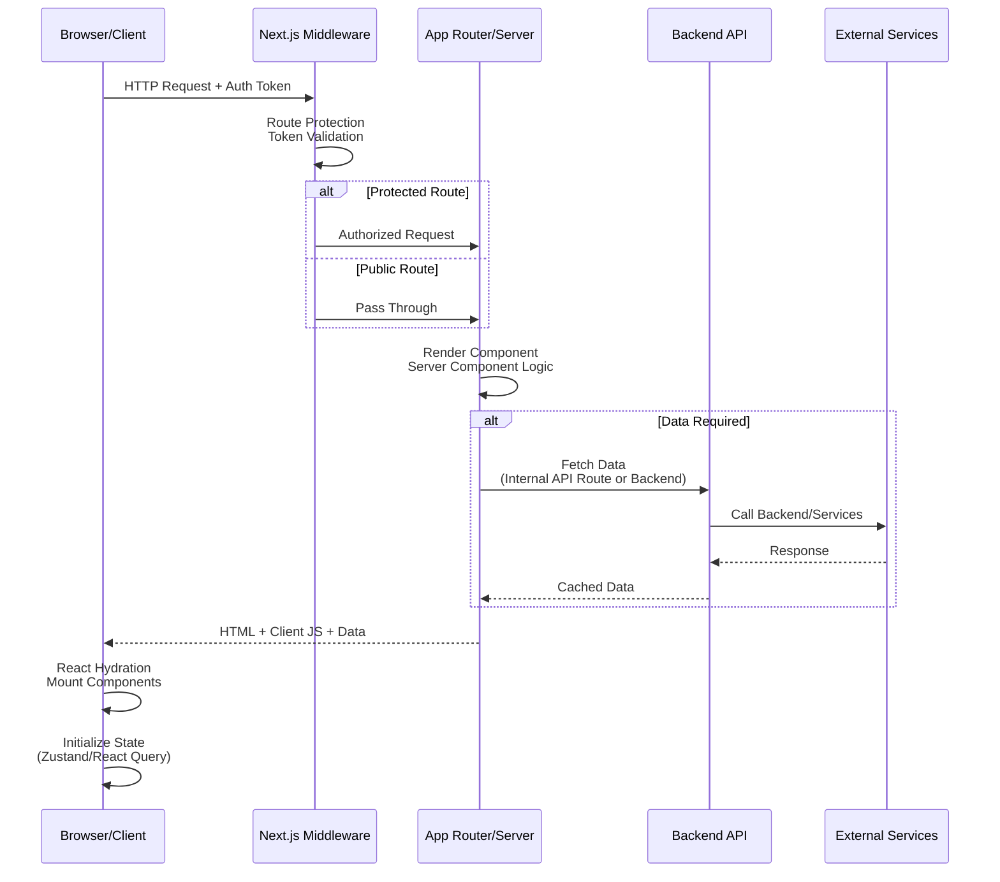

### 2. **Authentication & Authorization Flow**

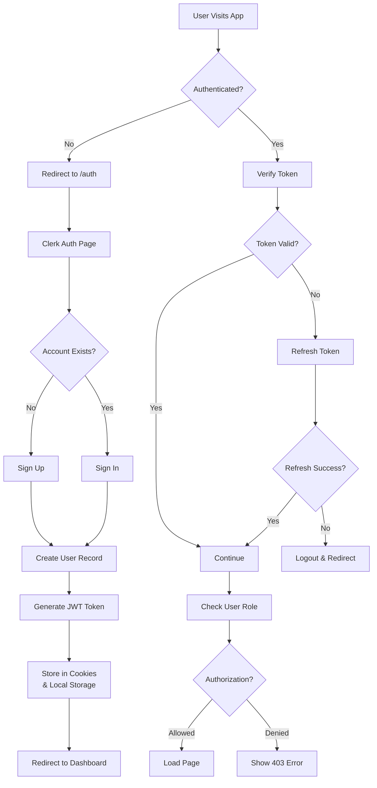

### 3. **Data Flow with React Query**

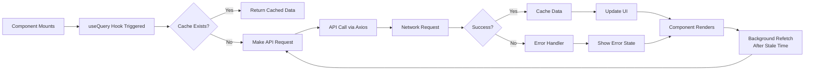

### 4. **Billing & Subscription Workflow**

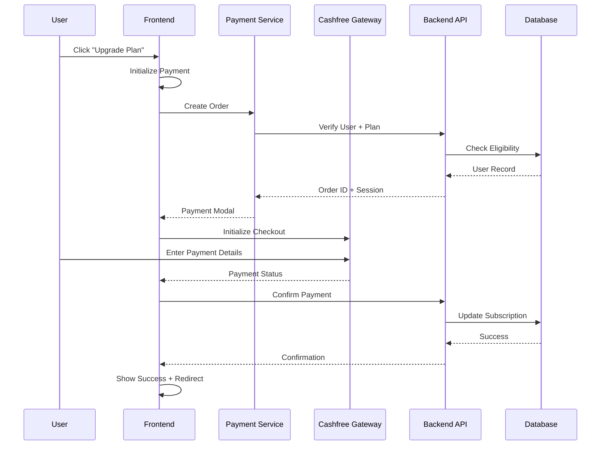

### 5. **Career Guidance & Recommendation Engine**

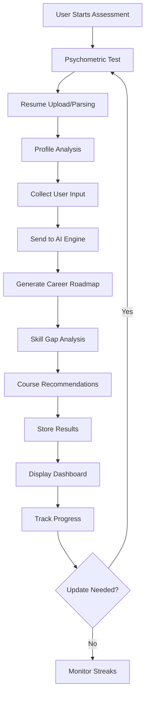

### 6. **Job Matching & Application Flow**

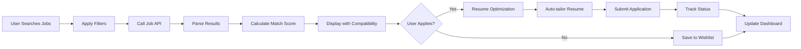

### 7. **Component Hierarchy & Layout System**

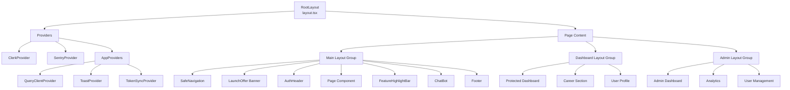

### 8. **State Management Strategy**

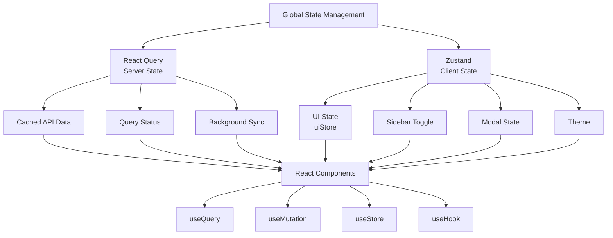

### 9. **API Integration Pattern**

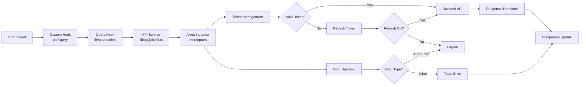

### 10. **Error & Loading State Handling**

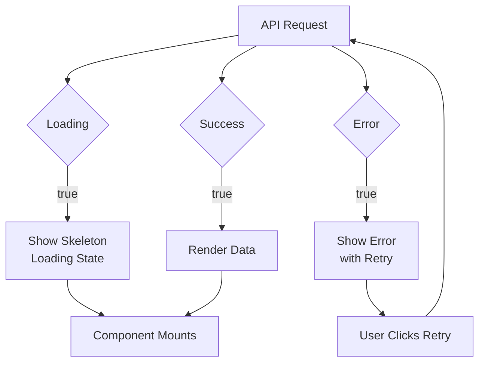

---

## 🔄 Key Data Flow Patterns

### Subscription Status Check

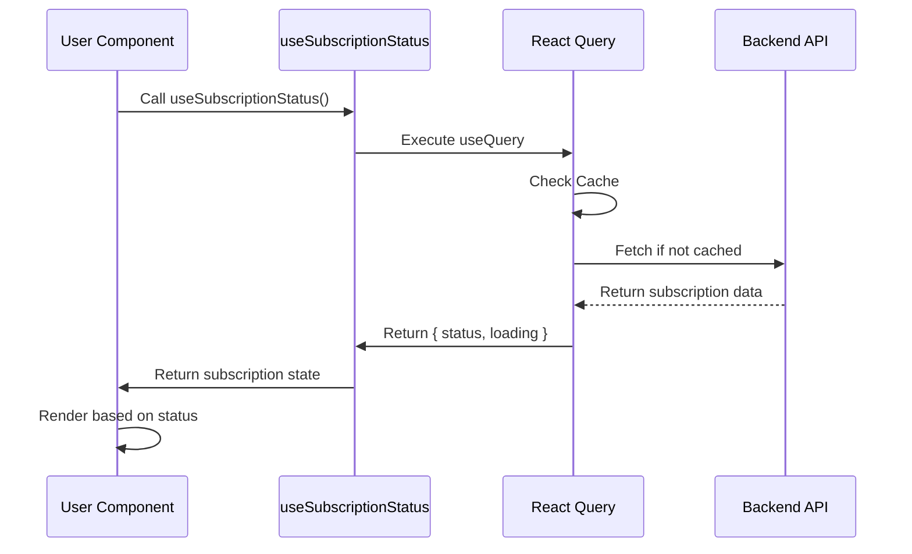

### Resume Upload & Parsing

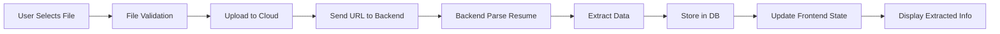

---

## 📱 Responsive Design System

- **Mobile-First Approach**: Tailwind CSS breakpoints
  - `sm`: 640px
  - `md`: 768px
  - `lg`: 1024px
  - `xl`: 1280px
  - `2xl`: 1536px

- **Component Variants**: Multiple layouts for different screen sizes
- **Adaptive Navigation**: Desktop nav vs mobile hamburger menu
- **Fluid Typography**: Responsive font scaling

---

## 🔐 Security & Performance Features

### Authentication
- **JWT Tokens**: Secure token-based authentication via Clerk
- **Refresh Token Rotation**: Automatic token refresh
- **XSS Protection**: React built-in + Helmet.js
- **CSRF Protection**: Next.js built-in handling

### Performance
- **Code Splitting**: Dynamic imports with React.lazy()
- **Image Optimization**: Next.js Image component
- **Caching Strategy**: React Query stale-while-revalidate
- **Bundle Analysis**: Monitor bundle size
- **Turbo Mode**: Fast development builds

### Monitoring
- **Sentry Integration**: Error tracking and performance monitoring
- **Google Analytics**: User behavior analytics
- **Custom Logging**: Centralized error handling

---

## 🚀 Getting Started

### Prerequisites
- Node.js 18+ 
- PNPM 8+
- Environment variables (see `.env.example`)

### Installation

```bash
# Install dependencies
pnpm install

# Set up environment variables
cp .env.example .env.local

# Run development server
pnpm run dev

# Open http://localhost:3000
```

### Build & Deploy

```bash
# Type check
pnpm run type-check

# Build for production
pnpm run build

# Start production server
pnpm run start

# Lint code
pnpm run lint
```

---

## 📦 Environment Variables

Key environment variables required:

```env
# Clerk Authentication
NEXT_PUBLIC_CLERK_PUBLISHABLE_KEY=
CLERK_SECRET_KEY=
NEXT_PUBLIC_CLERK_SIGN_IN_URL=
NEXT_PUBLIC_CLERK_SIGN_UP_URL=
NEXT_PUBLIC_CLERK_AFTER_SIGN_IN_URL=
NEXT_PUBLIC_CLERK_AFTER_SIGN_UP_URL=

# Backend API
NEXT_PUBLIC_API_URL=
NEXT_PUBLIC_API_KEY=

# Cashfree Payments
NEXT_PUBLIC_CASHFREE_KEY_ID=
NEXT_PUBLIC_CASHFREE_MODE=

# Sentry Monitoring
NEXT_PUBLIC_SENTRY_AUTH_TOKEN=
SENTRY_PROJECT=

# Google reCAPTCHA
NEXT_PUBLIC_RECAPTCHA_SITE_KEY=

# Analytics
NEXT_PUBLIC_GA_ID=
```

---

## 🧪 Testing & Quality Assurance

- **Type Safety**: TypeScript strict mode
- **Linting**: ESLint + Prettier
- **Pre-commit Hooks**: Husky integration (recommended)
- **API Testing**: Test endpoints with custom test data

---

## 📚 Documentation Structure

This repository contains only the **frontend** code. The backend API is maintained in a separate repository.

- **API Documentation**: See backend repo for API endpoints
- **Component Library**: Storybook stories (if available)
- **Design System**: Tailwind + Radix UI primitives
- **Deployment Guide**: See deployment docs

---

## 🤝 Contributing

1. Create a feature branch from `dev`
2. Follow TypeScript & ESLint standards
3. Test changes locally
4. Submit PR with clear description
5. Code review required before merge

---

## 📞 Support & Contact

For issues, questions, or feedback:
- **Email**: support@zobique.com
- **Documentation**: Check /docs folder
- **Issue Tracker**: GitHub Issues

---

*Empowering India's next generation, one career at a time.*


